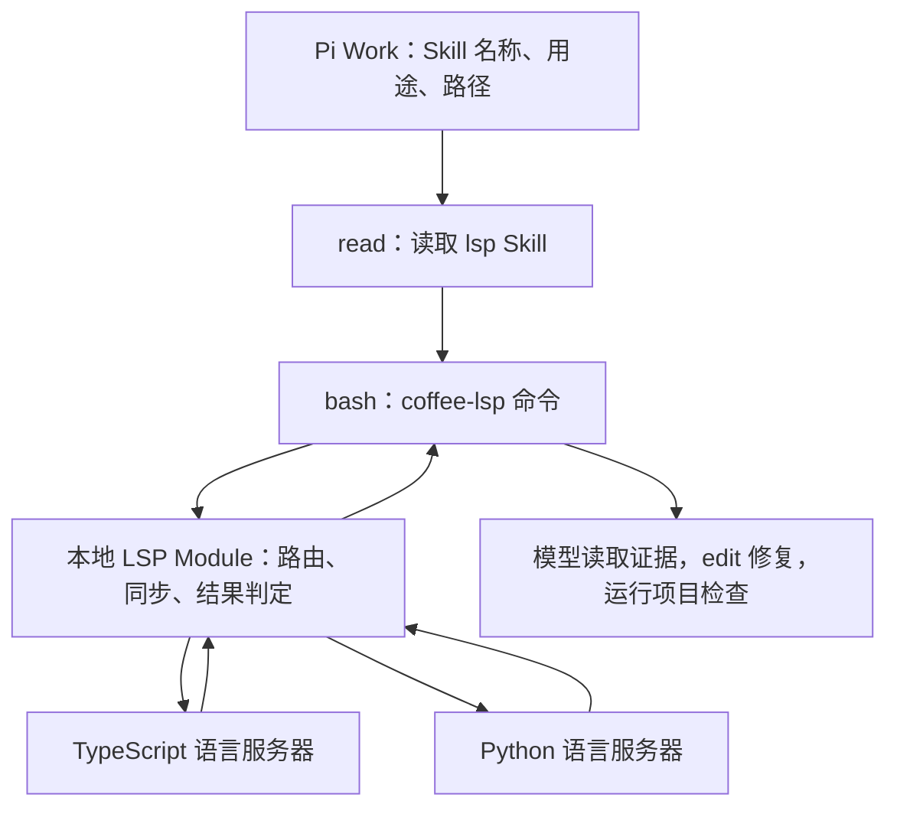

# LSP 中间层：Pi Skill 与 CLI

状态：**V1 CLI、Skill、TypeScript/Python Profile 与按需复用已实现并实测**。关联 PA-007、PA-011、PA-012。模型工具表精简、Chat/Work 运行时隔离、压力/性能基准和 V2 WorkspaceEdit 仍未完成。实现使用 CLI，不使用 MCP，也不依赖 pi-lens。

## 1. 目标与成功标准

LSP 提供编译器/语言服务器理解过的诊断、符号、定义、引用和类型信息。文本搜索仍用于定位候选文件；同名符号、别名、遮蔽和跨文件关系必须使用语义查询，不能把 `rg` 匹配称为精确引用。AST 与 lint 是补充能力，不等于 LSP。

交付必须同时满足三个层次：

1. **知道存在**：用户只描述开发问题，模型能从 Pi 原生 Skill 摘要发现语言能力、读取说明并调用 CLI，不需要用户报出工具名。
2. **正确调用**：定位正确工作区与语言服务器，使用正确文件/位置，等待初始化与文件同步，区分空结果、不支持、失败和未完成诊断。
3. **解决问题**：例如查到跨文件引用，修复错误 API 调用，再确认诊断消失且项目测试通过；服务进程启动或退出码为零不构成交付证据。

不增加常驻模型工具，不修改 Pi 内核，不建立 MCP 连接或新的 VM 沙箱。使用本地 LSP 协议与语言服务器通信是必需执行机制，不属于 MCP。

## 2. 一个外部 Interface



对模型的唯一 LSP Interface 是 `coffee-lsp` CLI 加返回契约。内部 Module 隐藏服务器启动、项目识别、坐标转换、文件同步、超时和诊断新鲜度。删除此 Module 后这些复杂性会重新落到每个 Skill/调用脚本中，因此它不只是转发参数的包装。

Skill 管使用方法；CLI/Module 管确定性正确性；语言服务器管语义。Skill 无法靠文字补救没启动的服务器或过期诊断。

## 3. 发现与按需加载

使用 Pi 已有的 Skill 发现机制。Work 的 Pi Base 中仅保留这一条 Skill 的名称、描述和真实文件路径，正文按需用 `read` 加载。推荐描述：

> 当任务涉及类型错误、跨文件定义/引用、同名符号歧义或修改影响范围时使用。通过 Bash 调用 coffee-lsp 获取项目语言服务器的语义证据；先检查可用能力，再查询与验证修改。

“按需”指说明正文和语言服务器按需使用，**能力摘要必须预先可见**，否则不能要求模型主动发现。摘要仍占少量上下文；只是没有增加工具 schema。具体预算在实测记录，不宣称零 token。

- Skill 不命名为 `code-check`，避免模型把它理解成仅检查命令；目标名称为 `lsp`，发布前检查用户已有同名 Skill，冲突必须可见。
- 首版不要求 `search_tools` 激活 LSP。Web/子 Agent 继续使用该目录，LSP 使用原生 Skills，避免“先发现一个工具才能发现说明”的循环。
- CLI 已安装但服务器未就绪时，Skill 仍可发现，`status` 明确返回缺项。CLI 未安装时由部署预检报安装错误，不能只发布一份指向不存在命令的 Skill。
- 只在 Work 装配该 Skill；Chat 零系统提示词要求照旧。模式切换/恢复必须验证最终请求中的 Skill 元数据，不能只测磁盘上有文件。
- 不加载 pi-lens 的原生 Pi 扩展；用户自行启用时需提示重复后端风险。不能靠设置 `PI_COFFEE_PI_LENS=off` 就假设用户全局发现也被关闭；扩展来源去重属于装配验收。

已交付 Skill 按以下流程约束模型：

1. 先根据问题定位文件，必要时用 Bash 文本搜索；没有语义需求的小编辑无需启动 LSP。
2. 运行 `coffee-lsp status --file ...`，读取服务器状态、支持操作和下一步建议。
3. 用 `symbols` 获取明确符号位置，再用 `definition`、`references`、`hover` 判断关系；不要仅凭名字猜同一符号。
4. 用 `diagnostics` 获得修改前证据，阅读相关源文件后按用户目标通过 `edit` 修改。
5. 再查变更文件及影响的调用方诊断，运行项目约定的编译、测试或 lint。报告证据范围与剩余问题。
6. 缺少服务器、操作不支持或结果不确定时，按返回建议处理；可以继续文本调查或编译检查，但必须保留证据来源，不能宣布 LSP 通过。

## 4. CLI 契约

建议可执行名 `coffee-lsp`；VM 安装一次，所有项目使用同一入口。没有参数或 `--help` 时只显示帮助，不启动服务器。默认 JSON 输出；`--help`/`--version` 是例外。每个普通调用输出一个版本化 JSON 对象，运行日志走 stderr。

```bash
coffee-lsp status --file src/app.ts
coffee-lsp symbols --file src/calculator.ts
coffee-lsp definition --file src/app.ts --line 4 --column 31
coffee-lsp references --file src/calculator.ts --line 9 --column 17
coffee-lsp hover --file src/calculator.ts --line 9 --column 17
coffee-lsp diagnostics --file src/app.ts
coffee-lsp diagnostics --file src/app.ts --file src/calculator.ts
```

例中路径和位置仅演示参数形状，实际位置来自当前文件或前一条返回。支持通用 `--workspace <path>`、`--timeout-ms <n>`、`--limit <n>`；外部目录先显式选择工作区。CLI 不接受任意 `executeCommand` 或任意协议方法透传。

| 操作 | V1 语义 | 重要约束 |
|---|---|---|
| `status` | 检查安装、路由、配置、会话状态 | 不启动语言服务器；区分配置预期能力与运行时协商得到的能力，未初始化不能报 ready |
| `symbols` | 指定文件的 document symbols，输出名称、种类、范围、选择位置 | 返回位置可直接复用于后续操作；项目级模糊符号搜索后续按需求扩展 |
| `definition` | 当前位置的精确定义 | 返回 Location/LocationLink 的统一结构及定义处小段源码 |
| `references` | 当前符号的精确引用，支持 `--include-declaration` | 服务端覆盖有局限时说明；同名文本不是同一符号 |
| `hover` | 当前符号的类型与说明 | 有界纯文本；结果为空时不声称不存在类型信息 |
| `diagnostics` | 对请求文件同步后获得可归属当前快照的诊断 | 默认不扫描整个仓库；按文件报告完成度与新鲜度，不能只报诊断条数 |

CLI 路径以调用者 CWD 解析，内部转绝对路径和 file URI。外部位置使用 **1 起点、Unicode code point 列**；LSP 使用的 0 起点与协商位置编码（包括 UTF-16）由 Module 转换，禁止直接透传。诊断和符号返回的所有位置也使用同一外部约定。

每个定位结果包含该文件 `sha256` 和 `location`。可选 `--expect-sha256` 用来校验后续定位查询；文件改变则返回 `stale_position` 并要求重取位置。简单查询可直接传行列，但它只保证查询最新文件，不能保证用户猜的位置仍指向同一符号。

V1 所有操作只读。模型仍用 `edit`/`write` 完成修复。重命名和 code actions 在 V2 使用 LSP WorkspaceEdit：先生成带文件 hash 的变更预览，再显式应用；校验所有前置版本与重叠编辑，出现失败需报告实际已应用集合，禁止声称跨文件天然原子。不能直接运行服务器返回的任意命令。AST 替换不作为 V1 的 LSP 必需功能。

## 5. 项目与服务器路由

- 有 `--workspace` 就以其作为工作区上限，否则从 CWD 与目标文件向上查找仓库/项目标记。monorepo 内按目标文件的最近语言配置确定 project root，不用“第一个 package.json”替代语言项目解析。
- 服务器 Profile 首版只维护两个实际试点：TypeScript/JavaScript 与 Python。建议先验证 `typescript-language-server`、`pyright-langserver`；确切版本与能通过哪些操作由安装探针锁定，不根据包名宣布兼容。直接 LSP Adapter 复用协议处理，Profile 仅负责启动参数、root 规则、依赖探测和诊断完成判定。
- 优先项目已有兼容服务器，其次 VM 提供的已测试版本。二进制绝对路径、版本、root 与配置摘要都出现在 `status`；不用 `npx latest` 在每次调用时安装。命令使用 argv 执行并显式传运行时 PATH，避免当前 Verify 的登录 shell PATH 问题。
- 多个配置都匹配时返回候选与 `ambiguous_project`，可用 `--workspace` 或部署配置消歧。没有受支持语言或服务器时给出 `unsupported_language` / `missing_server` 和安装建议，普通查询不自动修改项目依赖。
- 不同 Git worktree 的 canonical root 不同，不能共享语义状态；同仓库不同子项目可分别持有服务器。项目配置和服务器版本变化会使对应实例失效。

## 6. 生命周期：CLI 短连接，LSP 按需复用

CLI 调用方式不要求语言服务器每次退出。启动和初始化是 LSP 协议的工作；取消 MCP 不会取消这部分成本。首版使用一个按需创建的本地会话进程，内部维护 LSP 连接，CLI 经 Unix socket 提交一个有界请求；不是常驻 VM 平台或通用插件宿主。

- 首次语义查询才启动；空闲后退出。工程初值：空闲 5 分钟、初始化/单次查询总预算 30 秒，CLI 可覆盖查询预算；这些是待基准验证的默认值。
- 复用键为 owning Pi session、canonical workspace、project root、服务器与配置摘要。可利用现有 `PI_COFFEE_ROOT_SESSION` 作为会话输入，不让模型手工拼会话 ID。脱离 Host 的本机 Pi 以其公开扩展/启动入口提供实例 ID；没有实例 ID 的独立 CLI 使用同用户工作区级实例，并明确显示作用域。
- 不同 Pi 会话默认不共享易变语义状态；同会话子任务只对已落盘代码查询，Host 既有同文件写入串行规则仍有效。V1 不支持 IDE 未保存 buffer。
- socket 放用户运行目录，启动锁避免两个首次调用创建重复实例；限制活跃实例数量并回收空闲实例。上限建议 2 个语言实例/会话，忙时有界排队，超时返回 busy；部署可调整，最终值由内存/延迟实测确定。
- 浏览器断开不关闭实例或 Pi 会话。Pi session 结束时释放其拥有实例；异常退出由所属进程存活检查与空闲回收兜底。取消只取消当前请求，必要时发送 `$/cancelRequest`；不得杀死其他会话进程。
- 内部 LSP 通信顺序：spawn → initialize（声明实际支持的客户端能力与编码）→ initialized → 文档同步 → 请求。处理服务器的 configuration、动态能力注册等要求；服务器要求未实现能力时标注不支持，不能静默伪造应答。
- 进程崩溃返回 `server_crashed`；下一次只读请求可以重建。不要无限重试，也不能让旧缓存冒充重启后的结果。

## 7. 文件同步与诊断可信度

这是中间层最有价值的职责，不能留给 Skill 记忆。

1. 每次查询前核对已打开文档与目标文件的磁盘 hash；新文件发送 `didOpen`，变化发送递增版本的 `didChange`，按服务器协议需要处理保存。监听创建/删除/重命名及语言配置变化，同时在请求时补核对，不能仅依赖文件 watcher。
2. 尚未打开的其他文件依赖服务器的工作区索引和文件变化通知。批量查询变更文件与调用方；不能把单文件同步等同于整个 monorepo 索引完成。
3. 结果携带请求快照、文档 hash/版本和工作区 generation。返回前再次检查受影响文件；并发写入或配置变化时标为 stale，重新查询，不让旧位置支持新代码结论。
4. 支持 pull diagnostics 的服务器优先使用其请求结果与 resultId；只有返回对应快照的报告才算该范围已完成。
5. push diagnostics 必须等待可归属当前同步的 publishDiagnostics。Pyright 使用带版本通知；`typescript-language-server@4.3.4` 实测发送无版本通知，因此 TypeScript Profile 只在同一串行连接中、通知发生于本次 `didOpen`/`didChange` 之后、静默窗口完成且返回前磁盘 hash 未改变时确认结果。其他无版本 Profile 仍返回 `inconclusive`；不以等待数秒没有新消息当 clean。
6. 返回空诊断但不确定时 `diagnosticState=inconclusive`。只有本次请求文件都获得可确认报告且报告无诊断时才能 `diagnosticState=clean`，并注明是所选语言服务器、所选文件和所选检查范围内的 clean。

TypeScript 试点必须实际证明“发现已知错误 → 编辑 → 收到清除错误的报告”。若所选服务器无法可靠确认这一过程，更换服务器/Profile，或如实把其诊断能力列为受限，不能包装 `tsc` 结果冒充 LSP。编译/测试仍是独立最终验证，且可发现语言服务器覆盖之外的问题。

## 8. 结构化结果、错误与输出规模

每次语义操作返回统一 envelope：

```json
{
  "schemaVersion": 1,
  "operation": "diagnostics",
  "status": "partial",
  "workspace": "/workspace/demo",
  "projectRoot": "/workspace/demo",
  "server": { "id": "typescript", "state": "ready" },
  "snapshot": { "generation": 3, "documents": [{ "path": "src/app.ts", "version": 2, "sha256": "<hash>" }] },
  "coverage": { "requestedFiles": 1, "confirmedFiles": 0, "truncated": false },
  "diagnosticState": "inconclusive",
  "items": [],
  "issues": [{ "code": "diagnostics_unconfirmed", "message": "没有收到可归属本次文件版本的诊断报告。" }],
  "nextAction": "运行项目检查；不得将此结果报告为 LSP clean。"
}
```

- `status` 为 `ok | partial | unavailable | error`，诊断另外使用 `findings | clean | inconclusive`。导航空结果在完成请求时为 `ok`、`items=[]`、`emptyReason=no_match`，明确这是查询结果而非符号不存在的证明。
- `unsupported_operation` 在协商能力缺失时返回，不调用后端后再拿空结果糊弄。其他稳定 code 包括 `invalid_arguments`、`missing_server`、`ambiguous_project`、`stale_position`、`initializing_timeout`、`request_timeout`、`server_crashed`、`busy`。
- 退出码：0=操作完成（可以包含实际诊断 findings）；2=参数/位置错误；3=不可用或不支持；4=部分、超时或诊断不确定；5=内部/服务器失败。测试通过与否不能只根据 CLI 退出码；Skill 必须读取 envelope。
- 工程初值：最多返回 50 个位置、stdout 最大 16 KiB；超限标 `truncated`，有界分页或写 User VM artifact，不能截断为无效 JSON。分页绑定快照，文件变化后拒绝旧 cursor。
- 不把整个项目源码或服务器日志送模型。定位结果带少量相关行；所需全文仍用 `read`。缓存只存派生索引和必要状态，不存用户对话或模型认证信息。

## 9. 后端选择与 pi-lens 的位置

V1 采用直接连接真实语言服务器的 LSP Adapter。TS/Python 是同一协议处理的两个 Profile，避免从零做通用插件市场或为每个方法另建工具。Node/TypeScript 实现，JSON-RPC 编解码优先复用成熟库，具体依赖在实现时审查锁定。

pi-lens 不是必需依赖。现有 `pi-lens-analyze` 输出和退出码无法提供上述完整契约，也没有完整 CLI 导航入口；简单包一层 JSON 不能恢复它未输出的新鲜度证据。未经验证的深层 import 不作为稳定交付接口。以后若 pi-lens 提供稳定、非 MCP 的嵌入/CLI Interface，并通过同一契约验收，可提供候选 Adapter 或独立 AST/lint Skill；不改变模型使用方法。

现有[真实工具链报告](../reviews/real-agent-toolchain-20260921.md)仅证明旧路径存在 active 集合冲突与 LSP inconclusive/空导航，**没有证明 LSP 需求不可实现，也没有定位空结果的根因**。本文取代此前“仅保留 CLI 单文件检查、用文本搜索替代语义导航”的建议。

## 10. 交付与验收

实施从公开 CLI/Pi 接缝建立失败样例再实现。下表按 2026-09-21 本地证据更新；部分状态不等于整个阶段关闭。

| 阶段 / ID | 内容与验收 | 状态 |
|---|---|---|
| A / LSP-AC01 | CLI 基础、TS Profile、状态机、definition/references/hover/symbols/diagnostics；有意制造类型错误，返回真实诊断，再修复并确认清除 | **通过**：真实 `typescript-language-server@4.3.4` fixture 返回 TS2322，修改后 `clean`；六个公开操作有协议边界测试 |
| A / LSP-AC02 | 缺服务器、能力不支持、无版本 push、超时、崩溃、并发首次启动、取消、超量输出 | **部分**：稳定退出码、参数/能力错误、超时与诊断不确定语义已实现；取消、崩溃恢复和超量输出的完整故障矩阵待补 |
| A / LSP-AC03 | 修改后复查不使用旧 hash；同名局部变量不会污染 references；跨文件 import alias、Unicode 前缀、CRLF、带空格路径定位正确 | **部分**：快照/hash、`--expect-sha256`、Unicode code-point 转换和同名符号真实模型场景已过；CRLF/空格路径专项样例待补 |
| A / LSP-AC04 | 两个 worktree、monorepo 子项目、配置变更、新增/删除文件、浏览器断开与会话结束 | **部分**：最近语言配置路由、canonical root、Pi session/socket 隔离和 5 分钟空闲回收已实现；完整 worktree/配置变更矩阵待补 |
| B / LSP-AC05 | 部署 CLI/Skill，迁移 Work 的精简工具集合，关闭 pi-lens 原生扩展发现；Work 中可见摘要，无 LSP 工具 schema，Chat 不注入该摘要 | **部分**：包 bin、Host PATH、`--skill` 注入、打包复制和真实 Pi `skill:lsp` 可见已过；精简工具表与 Chat 隔离仍待迁移 |
| B / LSP-AC06 | `eidolon/gpt-5.6-terra` 只收到“修复跨文件 API 调用问题”等任务，自主读取 Skill、调用语义查询、编辑并验证 | **通过工程初值**：3 个 fixture × 3 次为 3/3、2/3、3/3；唯一失败正确修复并通过 `tsc`，但未调用 LSP，仍按失败保留 |
| B / LSP-AC07 | 初次启动与连续 10 次查询的耗时、峰值内存、进程数、摘要/正文/结果字节数 | **部分**：默认 Unix socket 复用测试证明连续调用只启动一个服务器；完整冷/热延迟、内存和上下文预算基准待补 |
| C / LSP-AC08 | Python Profile 的诊断、定义、引用与修改后刷新；V2 WorkspaceEdit 的预览、版本检查和失败恢复 | **V1 Python 通过，V2 待实现**：真实 `pyright@1.1.405` 诊断、跨文件定义、修改后 `clean` 已过；CLI 未宣传 rename/code actions |

真实模型任务至少包含：跨文件类型不匹配、两个同名符号的影响分析、改动函数签名后修复调用方。另加无需 LSP 的纯文本小修改作对照，避免把“每个任务强制启动服务器”当主动使用能力。记录调用参数、标准化结果、文件 diff 和项目检查；不保存完整私密 transcript。

首轮工程门槛：协议与真实服务器的确定性验收全部通过；9 次模型任务中每个场景至少 2/3 次完成“自主发现 → 有效语义查询 → 正确修改/结论 → 项目验证”，且全部样本不得把 unavailable/inconclusive 说成验证通过。此门槛是工程初值，不代表统计意义上的长期成功率；逐例披露失败，再调整 Skill 或 Interface。

建议实现位置：`src/lsp/cli.ts`、`src/lsp/workspace-session.ts`、`src/lsp/protocol.ts`、`src/lsp/profiles/`、`skills/lsp/SKILL.md`。内部文件可以调整；Host/Web 不导入语言服务器实现，Host 只提供现有会话身份与释放生命周期。公共测试跨 CLI 和 Pi 的 Skill/Bash 接缝。

Gitea Issue #1 本轮仍不可连接，PA-011/012、LSP-AC01～08 的实现证据待同步；未读取其最新状态、未更新或关闭远端工单。精简工具集合与 Chat/Work 隔离没有因本次 CLI 交付而自动完成。

实现证据：`test/lsp-cli.test.ts` 覆盖协议替身、诊断刷新、Skill 路径与 daemon 复用；`test/lsp-real-servers.test.ts` 覆盖真实 TypeScript/Python 服务器与 Unicode 坐标；[真实模型报告](../reviews/lsp-agent-evaluation-20260921.md)记录 9 次脱敏结果。最终全仓检查结果以本次交付报告为准。
